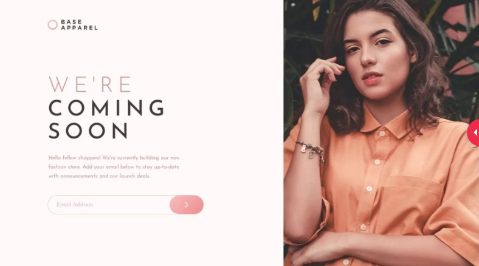

# Frontend Mentor - Base Apparel coming soon page solution

This is a solution to the [Base Apparel coming soon page challenge on Frontend Mentor](https://www.frontendmentor.io/challenges/base-apparel-coming-soon-page-5d46b47f8db8a7063f9331a0). Frontend Mentor challenges help you improve your coding skills by building realistic projects.

## Table of contents

- [Overview](#overview)
  - [The challenge](#the-challenge)
  - [Screenshot](#screenshot)
  - [Links](#links)
- [My process](#my-process)
  - [Built with](#built-with)
  - [What I learned](#what-i-learned)

## Overview

### The challenge

Users should be able to:

- View the optimal layout for the site depending on their device's screen size
- See hover states for all interactive elements on the page
- Receive an error message when the `form` is submitted if:
  - The `input` field is empty
  - The email address is not formatted correctly

### Screenshot

### Links

- Solution URL: [My Solution](https://www.frontendmentor.io/solutions/solution-to-base-apparel-ZMaXLNpXlr)
- Live Site URL: [Github Pages URL](https://kurtisivey.github.io/frontendmentor-base-apparel/)

## My process

### Built with

- Semantic HTML5 markup
- CSS custom properties
- Flexbox
- CSS Grid
- Mobile-first workflow
- [React](https://reactjs.org/) - JS library using Vite
- Sass

### What I learned

I'm been trying to refresh my skills on proper media query flow as I had previously been using tailwind css. While tailwind css is fantastic, I knew I was lacking in my conventional css skills. The hardest part of this project for me was the svg container within the submit button. For some reason, I could not figure out why the svg had a background as I don't ever deal with SVGs in such a way. However, after an hour or so, I landed on the solution of having the svg in an img tag and styling it with the css "fill: none". This simple solution fixed everything.
